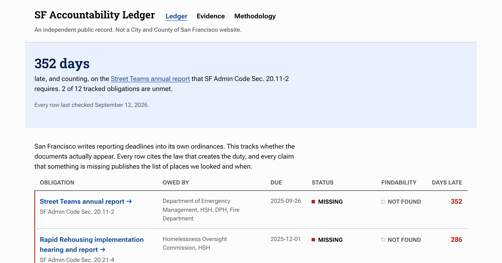
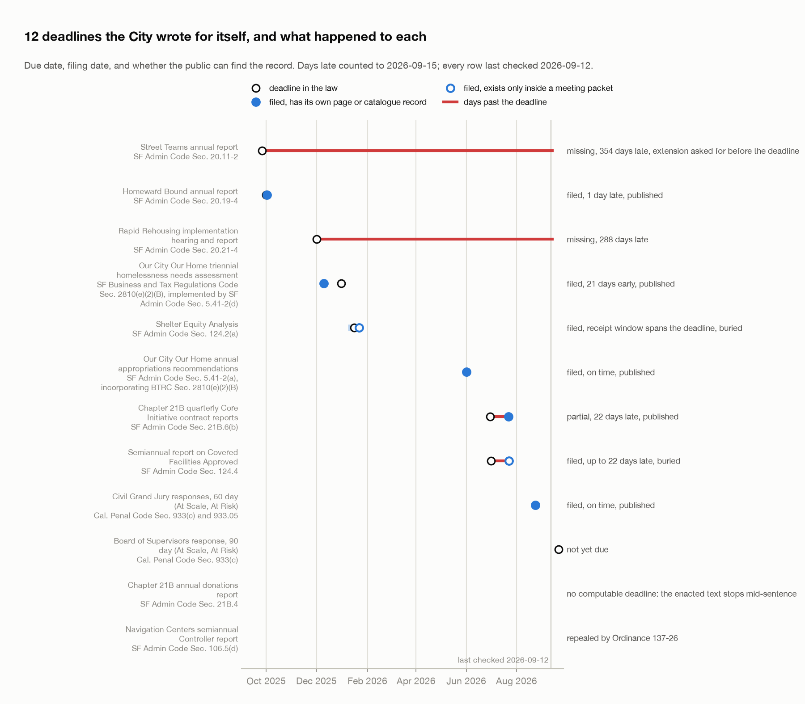
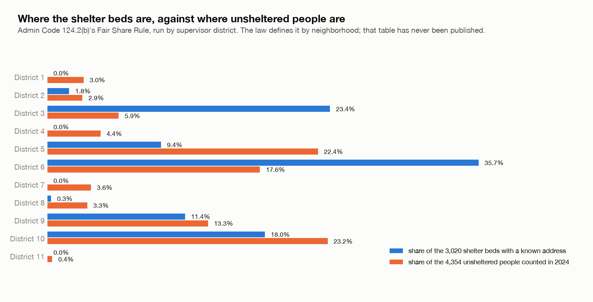

# SF Accountability Ledger



San Francisco writes reporting deadlines into its own ordinances. This tracks whether the documents actually show up, across homelessness, behavioral health and drug policy. Every row cites the law that creates the duty, the date the law sets, and the full list of places we looked. It's an independent public record, not a City and County of San Francisco website. No residents are named, and nothing here argues that any policy is good or bad.

Live at https://site-slpwlk.vercel.app.

## The question

Does the City file the reports its own laws require, and could a member of the public find them if it did? The thesis is that filed is not findable. A department can submit a report to the Board of Supervisors and it still has no page on sf.gov, no catalogue record, and nothing on the department's own site. It exists as one line in the Petitions and Communications section of a meeting agenda PDF. That's a different failure from not filing, so the ledger scores the two separately.

## The ledger

12 obligations, every row checked against primary sources, last on 2026-09-12. As the site reads today: 6 filed, 2 missing, 1 partial, 1 undeterminable (the enacted text stops mid-sentence, so no deadline can be computed), 1 repealed, 1 not yet due. On findability: 6 published, 2 buried, 4 not found.



Status asks whether the duty was discharged: missing, filed, partial, undeterminable, or repealed. A filed row also reads "filed late" when the filing date on the record is after the deadline. Findability asks whether a member of the public could locate the document: published (it has its own page or catalogue record), buried (it exists only inside a meeting packet or attachment), or not found.

The data is `data/manual/obligations.json`. It's hand curated and the site reads it as is. The page dates itself from the newest timestamp in the evidence, never from today's clock, and says so plainly when that check is more than 2 weeks old.

## Two findings

**Admin Code 124.2(a), the Shelter Equity Analysis.** The site launched saying this had never been published, 221 days overdue, against two named departments. That was false. HSH submitted it to the Board in January 2026, and it sits in the Petitions and Communications section of the 2026-01-27 agenda. The agenda records a receipt window (2026-01-08 to 01-22) rather than a date, and the 2026-01-16 deadline falls inside it, so we don't claim early or late. What we do claim is that it has no page on sf.gov, no catalogue record, and no entry on HSH's own reporting and compliance page. Filed, buried.

**Admin Code 124.4, the semiannual Covered Facilities report.** Due 2026-07-01, received by the Clerk between 2026-07-16 and 07-23, so 2 to 3 weeks late. It appears only as item (9) in the 2026-07-28 Board agenda, under the title "June 2026 Shelter Equity Analysis Report", which is the name of the other Chapter 124 deliverable. An earlier draft listed it as missing. Two independent adversarial checks found it, and it was then confirmed by hand in the agenda PDF. Filed late, buried.

Both corrections stay on the site on purpose, dated, with the original claim still visible. An absence claim is the most fragile thing a site like this can publish, and the method exists to catch exactly this.

Two rows still read missing. The Rapid Rehousing hearing and report (Admin Code 20.21-4, due 2025-12-01) is the one absence claim that survived a search of the venue that falsified the others. The Street Teams annual report (Admin Code 20.11-2, due 2025-09-26) has no located copy either, but DEM asked the Board for an extension before the deadline, so that row isn't a clean failure and says so. If you can show that anything listed as missing does exist, that's the correction we most want.

## How absence is verified

Absence is proven by enumerating, never by searching. `https://api.sf.gov/api/v2/` is a public, unauthenticated Wagtail API over roughly 94k pages and 59k documents. `documents/?order=-id&limit=1000&fields=title,created_at` walks the whole store. We listed all 58,905 documents and all 5,547 `sf.Report` pages and filtered the titles ourselves.

Board filings never enter that store. Every department filing is listed under Petitions and Communications in a Board of Supervisors agenda, and those agendas are plain PDFs at a predictable address, `https://media.api.sf.gov/documents/bag{MMDDYY}_agenda.pdf`. `pipeline/board_agendas.py` pulls every agenda since July 2025 and searches the full text on every run. Skipping that venue is what produced the false absence claims, including the two above.

Every check records the URL, HTTP status, result and date, and a new check needs a full timestamp or the data file refuses it. Every missing row lists the near misses it considered and rejected, and states the boundary of its own search.

## Where the beds are

The Shelter Equity Analysis is supposed to compare each neighborhood's share of shelter beds to its share of unsheltered people, the Fair Share Rule in Admin Code 124.2(b). The City has never published the neighborhood-level unsheltered table that test needs, so nobody outside the City can run it as written. The evidence page runs it by supervisor district instead, as a proxy, from the facility list the pipeline geocodes.



Districts 3 and 6 hold 59% of the beds we can place at an address and 24% of the people counted unsheltered in 2024. District 5 is the other way round, 9% of the beds and 22% of the people. Only 3,020 of the 5,148 beds in the 2026 Housing Inventory Count can be placed, so every share is approximate.

## What doesn't work

Written down so it doesn't get repeated.

- The codified Municipal Code on amlegal lags the ordinances. It still showed Admin Code 106.5(d) in force months after Ordinance 137-26 struck it. Never scrape the code to detect repeals. Track them from the ordinances, by hand.
- sf.gov CMS search matches all terms (AND semantics). Zero results for a multi-word phrase proves almost nothing.
- Legistar's public API responds, but its matter data stops at 2018-12-11. Every RSS feed returns "Invalid feed" and Calendar.aspx renders an empty grid. Board filings are visible only through the agenda PDFs above.
- Records requests for HSH, DPH and ADM (Real Estate) go through https://sanfrancisco.nextrequest.com. Planning is email only, CPC-RecordRequest@sfgov.org.
- Filing a request isn't a remedy. The Sunshine Ordinance Task Force averaged 138 days to hear complaints in 2025 against a 45 day statutory limit.

## How it's built

```
api.sf.gov Wagtail API       Board agenda PDFs        DataSF                          HSH shelter report,
(59k documents,              (every meeting since     (districts, neighborhoods,      Mission Local facility list
 5.5k sf.Report pages)        July 2025)               population, PSH, BH sites)
        |                          |                          |                              |
  fetch.py snapshots every source into data/raw/<date>/; board_agendas.py searches the agenda text
        |
  normalize.py, geocode.py, assign.py: each facility to a supervisor district and an Analysis Neighborhood
        |
  rollup.py and fairshare.py (beds against unsheltered, by district), choropleth.py (the SVG map)
        |
  ledger.py scores data/manual/obligations.json and writes everything to site/public/data/
        |
  Vite static site on Vercel: ledger, evidence, methodology, one page per obligation
  monitor.py watches for a document that would flip a row
```

The pipeline is stdlib Python; there's no requirements file because there's nothing to install. The site is plain HTML with a few modules under `site/src`. `site/verify.mjs` holds the built site to the design standards it states for itself (contrast, motion, print, internal links, viewport overflow) with Playwright. `docs/charts.py` redraws the 2 charts above from the data files (`uv run --with matplotlib python docs/charts.py`).

## Running it

```
python3 pipeline/run.py            # fetch every source, then build
python3 pipeline/run.py --no-fetch # reuse the raw snapshots in data/raw
```

Run it without `--no-fetch` the first time. The Mission Local facility list isn't in this repo (see Data sources), and `--no-fetch` fails without a snapshot of it on disk.

Tests:

```
python3 pipeline/test_ledger.py
python3 pipeline/test_pipeline.py
node site/src/common.test.mjs
```

Site:

```
cd site && npm ci && npm run dev
```

The standards check needs Playwright, which isn't a dependency here. Build and preview, then point it at the preview, with `PLAYWRIGHT_PKG` set to a Playwright install if there's none in `site/node_modules`:

```
cd site && npx vite build && npx vite preview --port 4173
node verify.mjs http://localhost:4173
```

Deploys are `vercel deploy --prod --yes` from `site/`. Nothing is wired to git.

## What's next

- Run the Fair Share test by Analysis Neighborhood, the geography the ordinance names, once a Point-in-Time report publishes a neighborhood table.
- A records request for each missing row, with the custodian's certificate of diligent search under Cal. Evidence Code 1284, so absence is on the record rather than argued.
- More chapters. The 12 rows are the homelessness, behavioral health and drug policy ordinances; the method works on any deadline the Code sets.
- Put `monitor.py` on a schedule with a notification, so a row flips within a day of the document appearing rather than at the 2-week recheck.

## Data sources

From `SOURCE_CITATIONS` in `pipeline/config.py`:

- Shelter capacity: HSH Temporary Shelter Programs report, 4/13/2026, https://media.api.sf.gov/documents/HSH_Shelter_System_Capacity_and_Occupancy_Report_4.13.26.pdf
- Shelter locations: Mission Local facility dataset (from HSH records request), https://missionlocal.org/2025/04/sf-map-homeless-shelters-restrictions/
- Permanent supportive housing: DataSF pyxv-n29e (MOHCD Affordable Housing Portfolio)
- Behavioral health sites: DataSF p6m6-pkpk (DPH MH and SUD Provider Directory)
- Districts: DataSF cqbw-m5m3 (Current Supervisor Districts, 2022 lines)
- Neighborhoods: DataSF j2bu-swwd (Analysis Neighborhoods, the ordinance's ACS Neighborhood Profile geography)
- Population: DataSF 4qbq-hvtt (ACS 5-year, supervisor districts)
- Citywide context: HSH 2026 HIC & PIT results, LHCB 6/1/2026, https://media.api.sf.gov/documents/2026_HIC__PIT_Results_-_LHCB.pdf

The Mission Local list supplies shelter addresses and coordinates only. Capacities come from the HSH report. Mission Local publishes the list without a reuse license, so the raw copy is gitignored (`data/raw/ml_facilities/`) and the pipeline fetches it from their Datawrapper chart on a first run.

Obligations, deadlines and evidence live in `data/manual/obligations.json`, with the research behind them in `research/`. `research/deadline-findings.md` is the research snapshot from 2026-08-25, written before two of the corrections above, so where it disagrees with the ledger the ledger wins. Ordinance PDFs come from the Clerk of the Board, code text from amlegal, and the Civil Grand Jury response clocks from the California Penal Code.

## License

Code is MIT (see LICENSE). The hand-curated data in `data/manual` and the findings in `research/` are CC BY 4.0.
